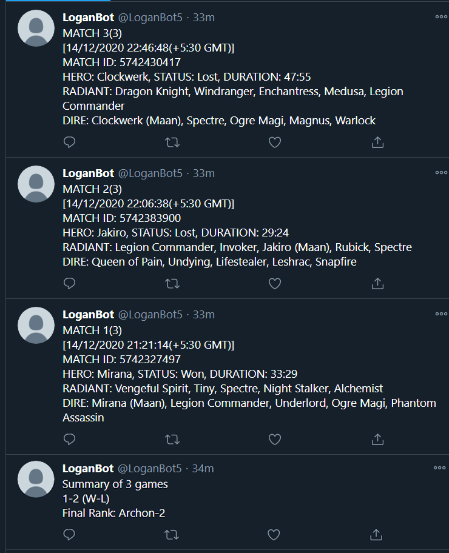

# Dota2 Match Bot

A simple python bot which tweets your recent matches (which have not been tweeted already) played on tweeter. Data collected using [OpenDota Web API](https://docs.opendota.com/#), data scraped using [BeautifulSoup](https://pypi.org/project/beautifulsoup4/) and [requests](https://pypi.org/project/requests/) library and tweeted using [Tweepy API](http://docs.tweepy.org/en/latest/).

### Installation

[Python]() should be installed on your machine.
You need to install following libraries:

- [BeautifulSoup](https://pypi.org/project/beautifulsoup4/)
- [Requests](https://pypi.org/project/requests/)
- [Tweepy](http://docs.tweepy.org/en/latest/)

Now you can download the repository or clone it using the following command

`>>> git clone https://github.com/MaanDodiya/dota2-twitter-bot.git`

In "twitter.py" file:

```
auth = tweepy.OAuthHandler("consumer_key", "consumer_secret")
auth.set_access_token("key", "secret")
```

- Replace the "consumer_key" with API key and "consumer_secret" with API Secret key
- Replace the "key" with Access Token key and "secret" with Access Token Secret key

[Refer this Tweepy Documentation if not working](http://docs.tweepy.org/en/latest/auth_tutorial.html#oauth-1a-authentication)

Run the python file in terminal
Enter your MMR in the terminal (Optional)(It is not tweeted but kept in log.dat file for future reference)

```>>> C:/Python39/python.exe twitter.py
Enter the MMR: 2490
```

Sample Tweets:
[](images/Tweet.png)

---

### About the author

- **Name**: Maan "2di.[L]ogan" Dodiya
- **MMR**: 2.5k
- **Roles**: Offlane, Support
- **Region**: SEA
- **Heroes**: Centaur Warrunner, Dazzle, Grimstroke, Dragon Knight, Doom
